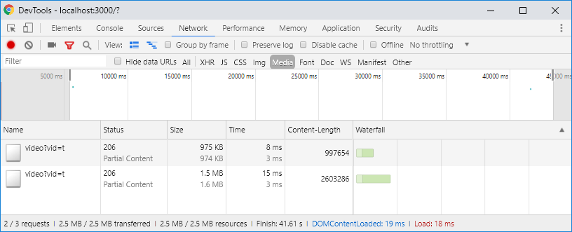

# Dokumentation UE 13<br/> von Janik Mayr<br/>
Einstiegs-URL: http://localhost:3000/<br/>
Ordner für Videos: ./public/videos/<br/>
## Network Behavior in Chrome Dev Tools
<br/>
Video benötigt zwei Requests um vollständig geladen zu werden. <br/>
Teil des Videos kann in diesem Fall beim Start noch gecashed sein(Da zu kleine Größe der Datei gesamt).
## Server
### GET auf Path: /video?vid=\<<name\>> Ablauf:
1)	Video identifizieren
     ```javascript
     /* Mithilfe von simplen Entscheidungsbaum können Abkürzungen verwendet werden. */
     if (param !== undefined) {
         if (param === 'yellifish' || param === 'yelli' || param === 'y') {
             path = 'public/images/yellifish.mp4';   //Video über Quallen
     } else {
         if (param === 'turtle' || param === 't') {
             path = 'public/images/turtle.mp4';      //Video über Schildkröten
         } /*ADD ELSE IF FOR OTHER VIDEOS HERE*/
     }
     ```
     Wenn das Video keinen Kurznamen hat, wird nach dem Dateinamen gesucht:<br/>
     ```javascript
        if (path === undefined || path == null) {
            path = `public/videos/${param}`;    //Pfad wird ergänzt
        }
     ```
2) Existiert Datei auf Pfad ?
    ```javascript
       fs.access(path, fs.F_OK, (err) => { //Nicht blockirender Zurgriff auf FileSystem,
           if (err) {                      // wenn File mit geg. Path nicht existiert wird ein Fehler geworden.
               //------- DATEI EXISTIERT NICHT FLOW -------
           } else {
               //------- DATEI EXISTIERT FLOW -------
           }
       }
    ```
    1)  Datei Existiert <br/>
           1) Größe des Files in ```fileSize``` Laden
           2) Aus Request die Range der Bytes aus Header ```const range = req.headers.range``` abfragen. (Fromat Range: ```bytes=%d-%d```, erste Zahl: Start Byte, Zweite Zahl: Bis Byte x maximal laden)
           3) Range r mit ?
               1) ```r[0,_[```:
                   1) Stringmanipulation von Range-ObjectString
                   2) Byterangestart parsen zu Integer(Radix 10)
                   3) Byterangeende parsen zu Integer(Radix 10)
                       ```javascript
                       /*Schritt a-c*/
                       const parts = range.replace(/bytes=/, "").split("-");
                       const start = parseInt(parts[0], 10);
                       const end = parts[1] ? parseInt(parts[1], 10) : fileSize - 1;
                       ```
                   4) Chunkgröße ermitteln ```chunksize = (end - start) + 1;```
                   5) Dateisector laden ```file = fs.createReadStream(path, {start, end})```
                   6) Response-Header erzeugen
                       ```javascript
                       const head = {
                            /*
                                Angaben in Bytes über die Übermittelten Daten: <Start>-<Ende>/<FileSizeGesamt>
                            */
                            'Content-Range': `bytes ${start}-${end}/${fileSize}`,
                            'Accept-Ranges': 'bytes',
                            /*
                                Größe des Chunkes ^= end - start + 1 (+ 1 um Array 0 Indexing auszugleichen)
                            */
                            'Content-Length': chunksize,
                            /*
                                Content-Type hard-coded auf mp4, falls andere Videoformate verfügbar,
                                muss dynamisch von File ableitent werden
                            */
                            'Content-Type': 'video/mp4',
                       };
                       ```
                   7) Response senden<br/>
                    Header mit Code 206 auf Stream schreiben. Code 206 bedeutet, dass es sich um partial content handelt und der Client den Rest noch anfragen muss. Der Chunk des File wird anschließend in den Responsebody geschrieben.
                       ```javascript
                           res.writeHead(206, head);
                           file.pipe(res);
                       ```
               2) ```r[x,_[```:
                   1) Response-Header erzeugen<br/>
                       Header mit Filesize, da das File auf einmal geladen wird. Content-Type hard-coded auf mp4, falls andere Videoformate verfügbar, muss dynamisch von File ableitent werden.
                       ```javascript
                           const head = {
                                'Content-Length': fileSize,
                                'Content-Type': 'video/mp4',
                           };
                       ```
                   2) Response senden<br/>
                       Header mit Code 200, da alles übermittelt wird.
                       ```javascript
                           res.writeHead(200, head);
                           fs.createReadStream(path).pipe(res);
                       ```
    2) Datei existiert nicht:
        ```javascript
            res.status(404).send('Not found'); // HTTP status 404: NotFound senden
        ```

## Client
1) Form:
   ```html
        <form>
           <input id="vn" type="text" value="">
           <input type="button" value="OK" onclick="loadVideo()">
        </form>
   ```
2) Load Video Method:<br/>
    Erstellen eines Videoplayers im Video Player Container und setzen der Source auf Request URL des Servers.
    ```javascript
        function loadVideo() {
              let div = document.getElementById("vp");  //Video Player Container Div
              let name = document.getElementById("vn").value; //Text aus Imputfield
              if (name !== undefined && name !== null && name.length > 0) {
                div.innerHTML = `<video controls autoplay>
                                    <source onerror="handleError()" src="/video?vid=${name}" type="video/mp4">
                                </video>`;
              }
        }
    ```
3) ErrorHandling:<br/>
    Wenn in der Source Tag innerhalb des VideoPlayers einen Fehler bekommt, wird folgende Methode ausgeführt.
    ```javascript
        function handleError() {
              alert('Video not found');
        }
    ```
